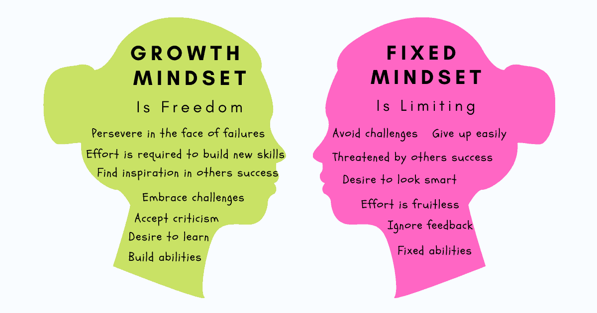

# growth mindset

## A growth mindset believes that one’s fundamental abilities can be developed through perseverance and effort; intelligence and talent are simply good starting points. A growth mindset is synonymous with a love of learning

## By contrast, in a fixed mindset, intelligence and talent are seen as fixed traits, suggesting that success comes from these inherent qualities alone, without the need for further development or effort

## how to keep yourself in a growth mindset

1. Acknowledge and embrace imperfections.
2. View challenges as opportunities.
3. try different learning tactics.
4. Follow the research on brain plasticity.
5. Replace the word “failing” with the word “learning.”

> you are free to read about the growth mindset

[to read more about growth mindset](https://www.atlassian.com/blog/inside-atlassian/growth-mindset)
