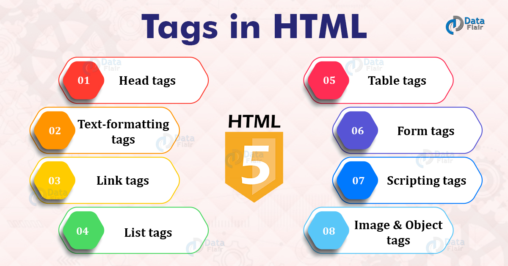

# HTML & CSS

## HTML :stands for Hypertext Markup Language. It is the standard markup language for documents designed to be displayed in a web browser

## HTML : describes the structure of a web page semantically and originally included cues for the appearance of the document.Web browsers receive *HTML* documents from a web server or from local storage and render the documents into multimedia web pages

## CSS : stands for Cascading Style Sheets It is a style sheet language used for describing the presentation of a document written in a markup language such as HTML

## how to design your page with HTML

1. Know and understand your target audience.
2. Determine the type of information that attract the audience by identifying their motivations and goals.
3. find out what the audience will achieve by visiting your website.
4. The needed frequency of changing and updating the information at your website to ensure high rate of revisiting by audience.
5. Create your site map by determining how the information will be presented.

## if you are a beginner in HTML here is a link for you to start

[HTML w3chools](https://www.w3schools.com/html/)
